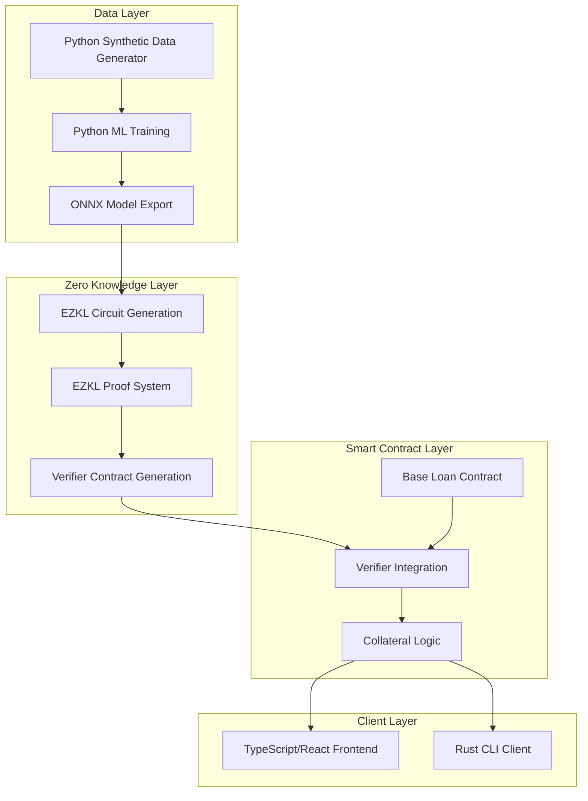

# Private Credit Score

## For Defi loans

SUMMARY

Defi loans necessitate substantial collateral. This project introduces private credit scoring, which allows for lower scoring requirements.    
**Simple Concept A:**  
A straightforward implementation would verify if a user has any scoring data to qualify for a loan with less than 100% collateral; otherwise, it would demand 120%.  
**Extended Concept B:**  
Collateral percentages are tiered based on users' scoring performance:  
1\. Unknown new user address \-\> 120% collateral requirement.  
2\. User with on-chain activity or low score \-\> 100% collateral.  
3\. User with medium score \-\> 90% collateral.  
4\. User with high score \-\> 80% collateral.

## Building a Credit Scoring ZKML using EZKL

EZKL is a zero-knowledge machine learning (ZKML) framework that enables privacy-preserving verification of AI/ML model inferences. It converts computational graphs (like neural networks) into zk-SNARK circuits, allowing users to prove that a model produced a specific output without revealing the input data or model weights. This is critical for DeFi lending systems that require trustless verification of credit scores while preserving user privacy.

## 1\. System Overview



## Fundamental Components

### ML Model

A simple regression/classification model (e.g., linear regression) to compute credit scores based on normalized inputs (e.g., transaction count, wallet age).

### Proof Generation

EZKL converts the model into a ZK circuit and generates proofs of valid inference.

### On-Chain Verification

A Solidity smart contract verifies proofs and issues loans based on credit scores.

## Project Plan: ZKML Credit Scoring DeFi System

## Data & Model Generation (Python)

* Generate synthetic credit data for training
* Train and export credit scoring model to ONNX format

## Zero Knowledge Layer (EZKL)

* Import ONNX model to EZKL
* Generate proving system
* Create a verifier contract template
* Depends on a completed model from Layer 1

## Smart Contract Layer (Solidity)

* Base loan management contract
* Collateral tiers
* Integration with ZK verifier
* Core logic can start independently, but verification needs task 2\.

## Web or CLI Application (TypeScript/React & Rust)

* Metamask web app for loan collateral  requests  
  – or –
* CLI interface for loan collateral requests
* Either can be developed with mock data while waiting for the deployed Contract.

## Presentation

* Slides
* Demo in phases done by each team member.

# Contract Interfaces

```solidity
// SPDX-License-Identifier: MIT  
pragma solidity ^0.8.28;

/**  
* @title ICollateralCalculator  
* @dev Interface for calculating required loan collateral based on credit score  
*/  
interface ICollateralCalculator {  
/**  
* @dev Enum representing different credit score tiers  
*/  
enum CreditTier {  
  UNKNOWN, // Unknown user \- 120% collateral  
  LOW, // Low score \- 100% collateral  
  MEDIUM, // Medium score \- 90% collateral  
  HIGH // High score \- 80% collateral
}

    /**  
     * @dev Struct containing collateral requirement details  
     */  
    struct CollateralRequirement {  
        uint256 requiredPercentage; // Collateral percentage (in basis points: 8000 \= 80%)  
        uint256 requiredAmount; // Actual collateral amount required for the requested loan  
        // optional enhanced tier  
        CreditTier tier; // The credit tier this requirement is based on  
    }

    /**  
     * @dev Get collateral requirement for a specific address and loan amount  
     * @param \_borrower Address of the borrower  
     * @param \_loanAmount Amount of the loan requested  
     * @return Collateral requirement details  
     */  
    function getCollateralRequirement(address \_borrower, uint256 \_loanAmount)  
        external  
        view  
        returns (CollateralRequirement memory);

    /**  
     * @dev Update credit score for an address after verifying ZK proof  
     * @param \_borrower Address of the borrower  
     * @param \_creditScore Verified credit score (public output from ZK proof)  
     * @param \_proofValidated Boolean indicating if the proof was validated  
     * @return New credit tier assigned  
     */  
    /**  
     * enhanced tier  
     *     function updateCreditScore(  
     *         address \_borrower,  
     *         uint256 \_creditScore,  
     *         bool \_proofValidated  
     *     ) external returns (CreditTier);  
     */  
}  
// SPDX-License-Identifier: MIT  
pragma solidity ^0.8.28;

/**  
* @title ICreditScoreLoanManager  
* @dev Combined interface for the main loan manager contract that integrates ZK verification  
* and collateral calculation  
*/  
interface ICreditScoreLoanManager {  
/**  
* @dev Event emitted when a credit score is validated with ZK proof  
*/  
event CreditScoreValidated(address indexed borrower, uint256 creditScoreTier, bytes32 proofHash);

    /**  
     * Optional for a more comprehensive credit score implementation  
     * @dev Event emitted when a new loan is created  
     */  
    event LoanCreated(  
        address indexed borrower,  
        uint256 loanId,  
        uint256 loanAmount,  
        uint256 collateralAmount,  
        uint256 collateralPercentage  
    );

    /**  
     * @dev Submit a credit score ZK proof to update borrower's credit tier  
     * @param \_proof The zkSNARK proof bytes  
     * @param \_publicInputs Array of public inputs to the proof (may include the borrower's address)  
     * @param \_creditScoreOutput The credit score resulting from the computation  
     * @return True if proof verification and update was successful  
     */  
    function submitCreditScoreProof(bytes calldata \_proof, uint256\[\] calldata \_publicInputs, uint256 \_creditScoreOutput)  
        external  
        returns (bool);

    /**  
     * @dev Calculate collateral requirement without submitting proof (preview function)  
     * @param \_borrower Address of the borrower  
     * @param \_loanAmount Amount of the loan requested  
     * @return amount Required collateral amount  
     * @return percentage Required collateral percentage  
     */  
    function calculateCollateralRequirement(address \_borrower, uint256 \_loanAmount)  
        external  
        view  
        returns (uint256 amount, uint256 percentage);

    /**  
     * @dev Request a loan with the current credit score/tier  
     * @param \_loanAmount Amount of the loan requested  
     * @return loanId ID of the created loan  
     * @return requiredCollateral Amount of collateral required  
     */  
    /**  
     * enhanced tier  
     * function requestLoan(  
     *     uint256 \_loanAmount  
     * ) external returns (uint256 loanId, uint256 requiredCollateral);  
     *  
     */

    /**  
     * @dev Get the borrower's credit tier as verified by zk proofs  
     * @param \_borrower Address of the borrower  
     * @return Credit tier level assigned to the borrower  
     */  
    /**  
     * enhanced tier  
     * function getBorrowerCreditTier(  
     *     address \_borrower  
     * ) external view returns (uint256);  
     *  
     */

    /**  
     * @dev Submit collateral and accept loan  
     * @param \_loanId ID of the loan previously requested  
     * @param \_collateralAmount Amount of collateral being submitted  
     * @return success True if loan acceptance was successful  
     */  
    /**  
     * enhanced tier  
     * function acceptLoan(  
     *     uint256 \_loanId,  
     *     uint256 \_collateralAmount  
     * ) external returns (bool success);  
     *  
     */  
}  
// SPDX-License-Identifier: MIT  
pragma solidity ^0.8.28;

import "./ICreditScoreLoanManager.sol";  
import "./ICollateralCalculator.sol";

/**  
* @title IEnhancedLoanManager  
* @dev Extended interface for a full-featured loan management system  
*/  
interface IEnhancedLoanManager is ICreditScoreLoanManager {  
/**  
* @dev Enum representing loan statuses  
*/  
enum LoanStatus {  
PENDING, // Loan created but not yet funded  
ACTIVE, // Loan is active  
OVERDUE, // Loan has missed payments  
LIQUIDATED, // Loan was liquidated due to insufficient collateral  
REPAID // Loan was fully repaid

    }

    /**  
     * @dev Struct containing loan details  
     */  
    struct Loan {  
        uint256 id;  
        address borrower;  
        uint256 principal;  
        uint256 collateralAmount;  
        uint256 collateralPercentage; // In basis points (8000 \= 80%)  
        uint256 interestRate; // In basis points (500 \= 5%)  
        uint256 startTime;  
        uint256 duration; // In seconds  
        uint256 lastPaymentTime;  
        uint256 amountRepaid;  
        LoanStatus status;  
        ICollateralCalculator.CreditTier tier;  
    }

    /**  
     * @dev Event emitted when a loan payment is made  
     */  
    event LoanPayment(uint256 indexed loanId, address indexed borrower, uint256 amountPaid, uint256 remainingPrincipal);

    /**  
     * @dev Event emitted when a loan is liquidated  
     */  
    event LoanLiquidated(  
        uint256 indexed loanId, address indexed borrower, uint256 collateralLiquidated, address liquidator  
    );

    /**  
     * @dev Event emitted when a loan is fully repaid  
     */  
    event LoanRepaid(uint256 indexed loanId, address indexed borrower, uint256 totalPaid, uint256 collateralReturned);

    /**  
     * @dev Request a loan with a ZK proof to update credit score in one transaction  
     * @param \_loanAmount Amount of the loan requested  
     * @param \_duration Duration of the loan in seconds  
     * @param \_proof The zkSNARK proof bytes  
     * @param \_publicInputs Array of public inputs to the proof  
     * @param \_creditScoreOutput The credit score resulting from the computation  
     * @return loanId ID of the created loan  
     * @return requiredCollateral Amount of collateral required  
     */  
    function requestLoanWithProof(  
        uint256 \_loanAmount,  
        uint256 \_duration,  
        bytes calldata \_proof,  
        uint256\[\] calldata \_publicInputs,  
        uint256 \_creditScoreOutput  
    ) external returns (uint256 loanId, uint256 requiredCollateral);

    /**  
     * @dev Deposit collateral and activate a pending loan  
     * @param \_loanId ID of the pending loan  
     */  
    function depositCollateralAndActivate(uint256 \_loanId) external payable;

    /**  
     * @dev Make a payment on an active loan  
     * @param \_loanId ID of the loan  
     * @param \_paymentAmount Amount to pay  
     * @return remainingPrincipal Remaining principal after payment  
     */  
    function makePayment(uint256 \_loanId, uint256 \_paymentAmount) external returns (uint256 remainingPrincipal);

    /**  
     * @dev Early repayment of an active loan  
     * @param \_loanId ID of the loan  
     * @return collateralReturned Amount of collateral returned  
     */  
    function repayLoan(uint256 \_loanId) external returns (uint256 collateralReturned);

    /**  
     * @dev Get loan details  
     * @param \_loanId ID of the loan  
     * @return Loan struct with all loan details  
     */  
    function getLoan(uint256 \_loanId) external view returns (Loan memory);

    /**  
     * @dev Get all loans for a borrower  
     * @param \_borrower Address of the borrower  
     * @return Array of loan IDs for the borrower  
     */  
    function getBorrowerLoans(address \_borrower) external view returns (uint256\[\] memory);

    /**  
     * @dev Check if a loan is eligible for liquidation  
     * @param \_loanId ID of the loan  
     * @return True if loan can be liquidated  
     */  
    function isEligibleForLiquidation(uint256 \_loanId) external view returns (bool);

    /**  
     * @dev Liquidate an undercollateralized loan (callable by anyone)  
     * @param \_loanId ID of the loan  
     * @return collateralLiquidated Amount of collateral liquidated  
     */  
    function liquidateLoan(uint256 \_loanId) external returns (uint256 collateralLiquidated);

    /**  
     * @dev Add supported collateral token  
     * @param \_collateralToken Address of the ERC20 token  
     * @param \_priceFeed Address of the price feed oracle  
     * @param \_liquidationThreshold Liquidation threshold in basis points (7500 \= 75%)  
     */  
    function addSupportedCollateral(address \_collateralToken, address \_priceFeed, uint256 \_liquidationThreshold)  
        external;

    /**  
     * @dev Update interest rates based on credit tier  
     * @param \_creditTier Credit tier enum value  
     * @param \_interestRate New interest rate in basis points  
     */  
    function updateInterestRate(ICollateralCalculator.CreditTier \_creditTier, uint256 \_interestRate) external;

    /**  
     * @dev Get current interest rate for a credit tier  
     * @param \_creditTier Credit tier enum value  
     * @return interestRate Interest rate in basis points  
     */  
    function getInterestRate(ICollateralCalculator.CreditTier \_creditTier)  
        external  
        view  
        returns (uint256 interestRate);  
}  
// SPDX-License-Identifier: MIT  
pragma solidity ^0.8.28;

/**  
* @title IZKCreditVerifier  
* @dev Interface for verifying zero-knowledge proofs of credit scoring  
* Note this contract is presuming the EZKL contract generated interfaces.  
*/  
interface IZKCreditVerifier {  
/**  
* @dev Verifies a zero-knowledge proof of credit score computation  
* @param \_proof The zkSNARK proof bytes  
* @param \_publicInputs Array of public inputs to the proof  
* @return True if the proof is valid, false otherwise  
*/  
function verifyProof(bytes calldata \_proof, uint256\[\] calldata \_publicInputs) external view returns (bool);

    /**  
     * @dev Gets the verification key hash used for this verifier  
     * @return The hash of the verification key  
     */  
    function getVerificationKeyHash() external view returns (bytes32);  
}
```